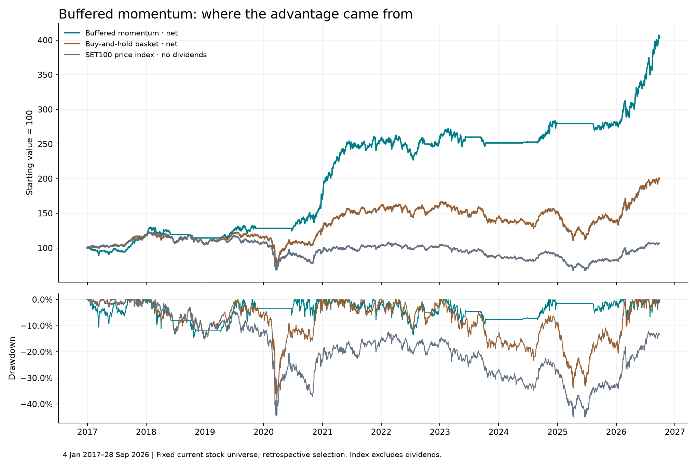

# Buffered momentum: annual and monthly analysis

**Frozen strategy e9a522bb24938501 — 4 January 2017 to 28 September 2026.** No strategy parameters were changed or optimized for this report. September 2026 is a partial month; 2026 is year-to-date. Starting capital is THB1,000,000.

The strategy returned **+304.77% net**, versus **+99.67%** for our buy-and-hold basket and **+6.41%** for the SET100 **price** index. It beat the basket in 9 of 10 calendar periods and 69 of 117 months. It did not win consistently every month or avoid all losses.

**Benchmark distinction:** the basket holds equal initial allocations to the current SET100 snapshot, with later-listed names bought when available and BANPU left as cash. Its prices and the strategy prices are dividend-adjusted. The actual SET100 index changes membership and uses market-capitalization weights; the price index excludes dividends. Therefore excess return over SET100 price is descriptive, not a like-for-like total-return alpha measure. Full SET100 TRI history was not accessible from the public sources checked; it was not estimated.

| Portfolio | Total return | Annualized return | Maximum drawdown | Ending value, THB |
|---|---:|---:|---:|---:|
| Buffered momentum, net | +304.77% | +15.45% | -14.50% | 4,047,692 |
| Buy-and-hold basket, net | +99.67% | +7.37% | -37.98% | 1,996,693 |
| SET100 price index, no dividends/costs | +6.41% | +0.64% | -45.02% | 1,064,085 |

Index ending value is a normalized illustration, not an investable after-cost portfolio.

## Annual comparisons

Returns compound from the previous calendar year’s closing value; the account is never reset in January. Gaps are percentage points (pp), not relative percentage changes.

| Year | Strategy, net | Basket, net | SET100 price | Gap vs basket, pp | Gap vs SET100 price, pp |
|---|---:|---:|---:|---:|---:|
| 2017 | +19.03% | +18.74% | +16.75% | +0.30 | +2.28 |
| 2018 | -3.89% | -11.09% | -9.83% | +7.20 | +5.94 |
| 2019 | +12.08% | +9.88% | +2.14% | +2.19 | +9.94 |
| 2020 | +32.43% | +7.20% | -13.03% | +25.23 | +45.46 |
| 2021 | +51.71% | +29.28% | +11.20% | +22.44 | +40.51 |
| 2022 | +0.16% | +2.02% | -0.32% | -1.85 | +0.48 |
| 2023 | -2.49% | -12.39% | -14.13% | +9.90 | +11.64 |
| 2024 | +11.14% | +6.44% | +1.08% | +4.69 | +10.05 |
| 2025 | -1.06% | -10.10% | -8.75% | +9.04 | +7.69 |
| 2026 YTD | +46.31% | +45.23% | +29.60% | +1.08 | +16.70 |

## Risk and costs by year

Within-year drawdown includes the prior December closing value as the starting anchor. This is different from the lifetime drawdown, whose peak may be in an earlier year. Exposure is the average fraction of portfolio value invested at each model close.

| Year | Strategy drawdown | Basket drawdown | Index drawdown | Mean invested | All-cash dates | Explicit fees, THB | Slippage, THB |
|---|---:|---:|---:|---:|---:|---:|---:|
| 2017 | -10.59% | -2.77% | -2.97% | 91.4% | 9 | 10,869 | 6,469 |
| 2018 | -14.50% | -14.88% | -15.22% | 48.0% | 121 | 10,020 | 5,966 |
| 2019 | -8.38% | -7.16% | -10.42% | 57.2% | 97 | 10,692 | 6,365 |
| 2020 | -9.62% | -34.99% | -37.32% | 46.7% | 118 | 4,987 | 2,967 |
| 2021 | -7.66% | -6.04% | -7.82% | 95.0% | 0 | 35,190 | 20,948 |
| 2022 | -13.61% | -11.59% | -10.03% | 86.6% | 21 | 30,682 | 18,264 |
| 2023 | -9.44% | -18.91% | -18.59% | 50.0% | 115 | 25,954 | 15,452 |
| 2024 | -4.26% | -12.23% | -10.82% | 33.4% | 117 | 18,864 | 11,229 |
| 2025 | -3.72% | -27.71% | -24.89% | 37.6% | 146 | 9,397 | 5,591 |
| 2026 | -7.74% | -10.27% | -10.57% | 95.0% | 0 | 32,567 | 19,386 |

**Cost assumptions:** commission 0.15% plus exchange/clearing/regulatory charges of 0.007%, then 7% VAT: **0.16799% explicit fees per side**, plus **0.10% slippage per side**. These are representative published rates, held constant through history, not a measured average across Thai brokers. No minimum commission in the base case. Cash earns zero; taxes and terminal liquidation are not modeled.

The strategy paid **THB189,222 explicit fees** and **THB112,639 execution slippage** over 1,512 fills. Both are already reflected in the reported net returns; do not subtract them again. These cash totals are not the full compounded cost drag of a hypothetical fee-free strategy. The basket’s explicit fees were THB1,660 across 99 buys.

Under the saved higher-cost case (0.27499% explicit fees plus 0.20% slippage per side and THB50 daily minimum commission before VAT), the same strategy returned **+262.47%**, with **−15.19% maximum drawdown**.

## What happened each year

- **2017:** Almost fully invested. It only narrowly beat the basket and had a much larger within-year drawdown: the strategy was not safer in every year. Largest net contributions: MEGA +3.25 pp, EA +2.60 pp, ERW +2.49 pp. Largest detractor: CBG -2.50 pp.
- **2018:** The strategy lost money but lost substantially less than either benchmark. Reduced exposure helped, yet this year contains its deepest lifetime drawdown. Largest net contributions: KTC +4.73 pp, IVL +0.63 pp, JMT +0.61 pp. Largest detractor: IRPC -1.41 pp.
- **2019:** It beat both benchmarks with moderate average exposure, although its within-year drawdown was worse than the basket’s. Largest net contributions: JMT +2.45 pp, PLANB +2.29 pp, BTS +1.79 pp. Largest detractor: PRM -1.43 pp.
- **2020:** A major source of the advantage: strong selected-stock gains alongside long cash periods. The current-universe basket also rose while the actual price index fell, highlighting how different those benchmarks are. Largest net contributions: DELTA +13.38 pp, RCL +7.06 pp, JMART +4.53 pp. Largest detractor: TASCO -2.02 pp.
- **2021:** The strongest calendar year. It stayed approximately 95% invested and captured large gains among its selected momentum stocks. Largest net contributions: RCL +12.52 pp, JMART +8.76 pp, GUNKUL +5.67 pp. Largest detractor: CCET -2.84 pp.
- **2022:** The weakest relative year versus the basket: near-zero net return, high exposure and substantial trading costs. Its drawdown also exceeded both benchmarks. Largest net contributions: DELTA +2.21 pp, GST +1.34 pp, BH +1.15 pp. Largest detractor: HANA -1.93 pp.
- **2023:** A losing year, but losses were much smaller than the benchmarks. Cash periods reduced participation in the decline. Largest net contributions: ICHI +2.67 pp, PLANB +1.10 pp, SIRI +0.84 pp. Largest detractor: HANA -1.33 pp.
- **2024:** A positive return despite low average exposure. Individual winners mattered; portfolio weights were allowed to drift between rebalances. Largest net contributions: CCET +8.93 pp, VGI +1.64 pp, PRM +1.18 pp. Largest detractor: STA -1.25 pp.
- **2025:** It mostly avoided the benchmarks’ losses, holding cash for much of the year. It still ended slightly negative. Largest net contributions: DELTA +1.34 pp, KKP +1.22 pp, KTB +1.08 pp. Largest detractor: THAI -4.24 pp.
- **2026 YTD:** A strong market rebound benefited both stock portfolios. The strategy’s advantage over the basket was only about one percentage point, much smaller than its gap versus the price index. Largest net contributions: KCE +6.55 pp, HANA +5.31 pp, IRPC +4.88 pp. Largest detractor: WHAUP -0.73 pp.

Contributions are actual marked stock P&L, including each stock’s transaction costs, divided by the portfolio’s starting value for that year. They sum to the strategy’s annual return; they are not each stock’s standalone percentage return.

## Monthly consistency

- **54 positive, 34 negative and 29 flat months** out of 117. Flat months reflect cash exposure in this zero-interest model.
- Beat the basket in **69/117 months (59.0%)**; beat SET100 price in **74/117 months (63.2%)**.
- Best month: **2021-01 +17.27%**. Worst month: **2023-04 -5.11%**.
- In months when SET100 price fell, average monthly returns were strategy **-0.10%**, basket **-2.70%**, index **-3.28%**.
- In months when SET100 price rose, averages were strategy **+2.61%**, basket **+4.10%**, index **+3.57%**. Its defensive behavior can miss part of a rally.
- Worst/best rolling 12-month strategy returns at month-end: **-11.40% / +97.28%**. The final endpoint is September 28, not a full September month-end.

Monthly conditional averages above are simple averages, not compounded capture ratios.

## Drawdown, recovery and concentration

- Deepest strategy drawdown: **−14.50%**, from the January 29, 2018 peak to October 24, 2018. It recovered on July 25, 2019: **542 calendar days** after the peak.
- A shallower **−9.44%** drawdown starting February 21, 2023 did not recover until November 7, 2024: **625 days**. Lower drawdown does not mean a quick recovery.
- The basket’s deepest drawdown was **−37.98%**; SET100 price fell **−45.02%** from its 2018 peak and had not regained that peak by September 28, 2026.
- Average invested exposure: **63.29%**. Entirely in cash on **744/2,370 model dates (31.4%)**. The 5% reserve is a target at rebalancing, not a guarantee that only 5% stays in cash.
- Equal target weights are about 6.33% per stock, but the largest observed stock weight reached **15.40%** between rebalances. Winners can become concentrated.
- There is **no fixed stop-loss or daily trailing stop** in this recipe. Exits depend on the scheduled momentum/trend/market checks and next-session tradability. Maximum historical drawdown is not a guaranteed loss limit.

| Largest net P&L contributors | THB | Share of total net profit |
|---|---:|---:|
| RCL | 309,792 | 10.2% |
| DELTA | 298,223 | 9.8% |
| KCE | 285,487 | 9.4% |
| GUNKUL | 195,683 | 6.4% |
| KKP | 185,197 | 6.1% |
| JMT | 185,091 | 6.1% |
| JMART | 182,245 | 6.0% |
| CCET | 180,680 | 5.9% |
| HANA | 152,506 | 5.0% |
| IRPC | 112,238 | 3.7% |

The top three contributed about 29% of net profit. This is accounting attribution, not an estimate of the result if those stocks had been excluded; replacement holdings would change the path.

## Calendar audit and limits

The stock provider includes seven zero-volume placeholder dates on official 2026 exchange holidays: May 1, May 4, June 1, June 3, July 28, July 29 and August 12. No frozen-strategy fills occurred on them. For daily comparison only, SET100’s prior observed close is carried on those dates and `index_observed=False` identifies them. All monthly and annual boundaries have actual index observations. No market prices were invented.

A separate same-parameter replay removing those seven dates returned **+304.93%** with **-14.50% drawdown**, versus the frozen +304.77% / −14.50%. The basket was unchanged. The holiday counting issue has only a small effect in this particular replay; the primary tables preserve the exact result you asked about. This is a diagnostic rerun of the same candidate, not another optimized strategy.

Two actual index sessions, January 13, 2017 and January 2, 2024, have no stock-panel observations. The frozen portfolio’s previous value is carried only for the comparison chart and flagged `portfolio_observed=False`; stock bars and trades were not invented. Index drawdown uses all actual index sessions. Monthly/yearly endpoints are unaffected, but the original strategy’s indicator and execution history remains subject to these missing observations. The seven-holiday replay does not repair these missing stock sessions.

The fixed current membership creates survivorship and selection bias. The actual index has historical constituent changes. BANPU is quarantined; some entity histories are short; THAI’s suspension/restructure history is a sensitivity concern. The engine uses fractional adjusted units and simplified fills, without board lots, tick-size restrictions, market impact or a complete tradability history. Stale marks can understate risk. Dividends are represented through adjusted prices, not a separate tax-aware cash ledger.

The strategy was selected after 552 recipes had been examined. No dates through September 28, 2026 are untouched. It failed the earlier strict requirement to improve both return and drawdown under every sensitivity scenario. These results describe a fitted historical candidate; they do not establish it as the best future strategy.

## Data, reproducibility and verification

- [SET100 series at TradingView](https://www.tradingview.com/symbols/SET-SET100/): 5,000 daily bars retrieved September 29, 2026. Today’s incomplete bar is excluded.
- [Independent year-end checkpoints](https://www.ivglobal.co.th/uploads/research/260105.pdf): SET100 2024 close 1,959.79 and 2025 close 1,788.35. [Latest historical checkpoint](https://www.investing.com/indices/set-100-historical-data): September 28, 2026 close 2,317.78.
- [SET100 methodology](https://www.set.or.th/en/market/index/set100/profile), [TRI explanation](https://www.set.or.th/en/market/index/tri/profile), [official holidays](https://www.set.or.th/en/about/event-calendar/holiday), [fee source](https://www.kasikornsecurities.com/en/startinvesting/fee/thai-stocks).
- Daily cash/holdings replay agrees with the frozen equity curve within floating-point tolerance. Stock P&L sums to daily portfolio P&L. Compounded monthly returns reconcile to annual and full-period returns for all three series.
- [Data hashes and source metadata](provenance.json), [annual CSV](annual_comparison.csv), [monthly CSV](monthly_comparison.csv), [daily comparison](daily_comparison.csv), [daily exposure/costs](daily_diagnostics.csv), [annual stock attribution](annual_stock_contributions.csv), [drawdown episodes](drawdown_episodes.csv), [calendar replay](calendar_audit.json).
- Reproduce with `.venv/bin/python -m scripts.analyze_buffered_momentum`, then `scripts.audit_buffered_calendar` and `scripts.report_buffered_analysis` using the same module invocation. Frozen source files are unchanged.

## Every month

| Month | Strategy, net | Basket, net | SET100 price | Gap vs basket, pp | Gap vs index, pp |
|---|---:|---:|---:|---:|---:|
| 2017-01 | -2.67% | +1.03% | +2.06% | -3.70 | -4.73 |
| 2017-02 | -1.27% | -0.44% | -0.69% | -0.83 | -0.58 |
| 2017-03 | -0.33% | +1.70% | +1.66% | -2.03 | -1.99 |
| 2017-04 | -0.71% | -0.11% | -0.29% | -0.60 | -0.42 |
| 2017-05 | -1.31% | +0.36% | -0.55% | -1.67 | -0.76 |
| 2017-06 | +2.85% | +1.58% | +0.71% | +1.28 | +2.14 |
| 2017-07 | -2.32% | -0.44% | +0.41% | -1.88 | -2.73 |
| 2017-08 | +3.13% | +3.42% | +3.04% | -0.29 | +0.09 |
| 2017-09 | +6.73% | +4.22% | +3.55% | +2.51 | +3.18 |
| 2017-10 | +7.27% | +4.78% | +2.80% | +2.49 | +4.48 |
| 2017-11 | +1.06% | -1.19% | -1.07% | +2.26 | +2.13 |
| 2017-12 | +5.80% | +2.60% | +4.14% | +3.19 | +1.66 |
| 2018-01 | +8.47% | +2.97% | +4.21% | +5.50 | +4.26 |
| 2018-02 | -0.94% | -1.67% | +0.82% | +0.73 | -1.76 |
| 2018-03 | -4.91% | -3.83% | -3.00% | -1.08 | -1.91 |
| 2018-04 | +3.03% | +0.97% | +0.56% | +2.07 | +2.47 |
| 2018-05 | -3.32% | -1.69% | -3.20% | -1.63 | -0.12 |
| 2018-06 | -1.40% | -7.21% | -8.01% | +5.81 | +6.61 |
| 2018-07 | +0.00% | +5.41% | +7.54% | -5.41 | -7.54 |
| 2018-08 | +0.00% | +2.43% | +1.16% | -2.43 | -1.16 |
| 2018-09 | +0.00% | +3.62% | +2.12% | -3.62 | -2.12 |
| 2018-10 | -4.94% | -5.10% | -5.24% | +0.16 | +0.30 |
| 2018-11 | +0.74% | -1.52% | -1.39% | +2.26 | +2.13 |
| 2018-12 | +0.00% | -5.19% | -4.82% | +5.19 | +4.82 |
| 2019-01 | +0.00% | +4.45% | +5.15% | -4.45 | -5.15 |
| 2019-02 | +0.00% | +1.28% | +0.58% | -1.28 | -0.58 |
| 2019-03 | +0.00% | -0.10% | -0.97% | +0.10 | +0.97 |
| 2019-04 | +3.33% | +4.19% | +2.35% | -0.86 | +0.98 |
| 2019-05 | -0.39% | -1.89% | -3.29% | +1.50 | +2.90 |
| 2019-06 | +6.58% | +6.06% | +7.11% | +0.53 | -0.53 |
| 2019-07 | +4.00% | +0.54% | -1.59% | +3.46 | +5.59 |
| 2019-08 | +1.42% | -1.37% | -3.29% | +2.80 | +4.71 |
| 2019-09 | -4.69% | -1.55% | -0.93% | -3.13 | -3.75 |
| 2019-10 | +1.62% | -0.77% | -1.80% | +2.40 | +3.42 |
| 2019-11 | -0.00% | +0.37% | -0.35% | -0.37 | +0.35 |
| 2019-12 | +0.00% | -1.35% | -0.30% | +1.35 | +0.30 |
| 2020-01 | +0.00% | -3.67% | -4.98% | +3.67 | +4.98 |
| 2020-02 | +0.00% | -10.43% | -11.52% | +10.43 | +11.52 |
| 2020-03 | +0.00% | -17.33% | -16.28% | +17.33 | +16.28 |
| 2020-04 | +0.00% | +19.99% | +16.05% | -19.99 | -16.05 |
| 2020-05 | +0.00% | +6.10% | +3.20% | -6.10 | -3.20 |
| 2020-06 | -1.10% | +0.12% | -0.79% | -1.22 | -0.31 |
| 2020-07 | +8.74% | +2.46% | -1.88% | +6.28 | +10.62 |
| 2020-08 | +2.70% | +0.11% | -1.75% | +2.59 | +4.45 |
| 2020-09 | -1.43% | -3.75% | -7.19% | +2.33 | +5.76 |
| 2020-10 | +2.44% | -0.40% | -3.99% | +2.84 | +6.43 |
| 2020-11 | +6.24% | +14.24% | +20.56% | -8.00 | -14.32 |
| 2020-12 | +11.76% | +4.95% | +0.41% | +6.81 | +11.35 |
| 2021-01 | +17.27% | +5.56% | +1.16% | +11.71 | +16.11 |
| 2021-02 | +3.01% | +2.82% | +2.18% | +0.19 | +0.83 |
| 2021-03 | +10.07% | +7.11% | +4.66% | +2.96 | +5.41 |
| 2021-04 | +6.67% | +2.43% | -1.36% | +4.23 | +8.03 |
| 2021-05 | +2.91% | +4.23% | +0.75% | -1.32 | +2.16 |
| 2021-06 | +0.94% | -0.90% | -0.57% | +1.85 | +1.51 |
| 2021-07 | -1.15% | -2.72% | -4.50% | +1.58 | +3.36 |
| 2021-08 | -0.30% | +6.15% | +8.44% | -6.46 | -8.74 |
| 2021-09 | -1.74% | -5.34% | -2.68% | +3.60 | +0.93 |
| 2021-10 | +2.62% | +1.75% | +1.19% | +0.87 | +1.43 |
| 2021-11 | -3.20% | -0.57% | -3.66% | -2.63 | +0.46 |
| 2021-12 | +7.05% | +6.28% | +5.89% | +0.77 | +1.17 |
| 2022-01 | -2.45% | -3.36% | -0.23% | +0.91 | -2.22 |
| 2022-02 | +1.64% | +2.29% | +2.01% | -0.65 | -0.37 |
| 2022-03 | +2.10% | +1.98% | +0.35% | +0.12 | +1.74 |
| 2022-04 | -1.41% | +0.17% | -2.72% | -1.58 | +1.31 |
| 2022-05 | -1.86% | -0.34% | +1.33% | -1.52 | -3.18 |
| 2022-06 | -4.98% | -6.95% | -5.34% | +1.97 | +0.36 |
| 2022-07 | -1.44% | +0.97% | +0.43% | -2.41 | -1.87 |
| 2022-08 | +7.47% | +4.04% | +3.97% | +3.43 | +3.50 |
| 2022-09 | -1.56% | -4.12% | -4.58% | +2.56 | +3.02 |
| 2022-10 | +0.00% | +0.42% | +2.28% | -0.42 | -2.28 |
| 2022-11 | +0.59% | +4.35% | +1.50% | -3.76 | -0.91 |
| 2022-12 | +2.61% | +3.22% | +1.12% | -0.61 | +1.50 |
| 2023-01 | +3.90% | +0.16% | -0.79% | +3.74 | +4.69 |
| 2023-02 | -0.55% | -2.37% | -2.99% | +1.82 | +2.45 |
| 2023-03 | +0.32% | +0.09% | +0.22% | +0.22 | +0.10 |
| 2023-04 | -5.11% | -7.02% | -5.43% | +1.92 | +0.32 |
| 2023-05 | +0.56% | +2.06% | +0.01% | -1.50 | +0.55 |
| 2023-06 | +1.89% | -3.12% | -0.97% | +5.00 | +2.86 |
| 2023-07 | +0.00% | +3.88% | +4.65% | -3.88 | -4.65 |
| 2023-08 | +0.00% | +3.59% | -0.05% | -3.59 | +0.05 |
| 2023-09 | -3.14% | -6.08% | -5.98% | +2.94 | +2.84 |
| 2023-10 | -0.11% | -7.83% | -5.49% | +7.72 | +5.38 |
| 2023-11 | +0.00% | -0.06% | -0.37% | +0.06 | +0.37 |
| 2023-12 | +0.00% | +4.58% | +2.64% | -4.58 | -2.64 |
| 2024-01 | +0.00% | -4.10% | -4.63% | +4.10 | +4.63 |
| 2024-02 | +0.00% | -0.90% | +0.24% | +0.90 | -0.24 |
| 2024-03 | +0.00% | +1.04% | +0.94% | -1.04 | -0.94 |
| 2024-04 | +0.00% | -0.15% | -0.77% | +0.15 | +0.77 |
| 2024-05 | +0.27% | +1.60% | -1.60% | -1.33 | +1.87 |
| 2024-06 | +0.41% | -3.43% | -3.00% | +3.84 | +3.41 |
| 2024-07 | -0.18% | -0.39% | +2.28% | +0.21 | -2.46 |
| 2024-08 | +0.20% | +4.04% | +3.07% | -3.84 | -2.87 |
| 2024-09 | +2.84% | +7.79% | +7.03% | -4.95 | -4.19 |
| 2024-10 | +3.20% | +2.58% | +1.88% | +0.62 | +1.32 |
| 2024-11 | +2.45% | -0.66% | -2.51% | +3.11 | +4.95 |
| 2024-12 | +1.51% | -0.60% | -1.31% | +2.11 | +2.82 |
| 2025-01 | +0.00% | -10.24% | -6.15% | +10.24 | +6.15 |
| 2025-02 | +0.00% | -8.31% | -9.75% | +8.31 | +9.75 |
| 2025-03 | +0.00% | -4.95% | -4.04% | +4.95 | +4.04 |
| 2025-04 | +0.00% | +5.75% | +4.35% | -5.75 | -4.35 |
| 2025-05 | +0.00% | -3.28% | -4.08% | +3.28 | +4.08 |
| 2025-06 | +0.00% | -5.80% | -5.12% | +5.80 | +5.12 |
| 2025-07 | +0.00% | +17.15% | +15.37% | -17.15 | -15.37 |
| 2025-08 | -2.82% | +0.84% | -0.78% | -3.66 | -2.04 |
| 2025-09 | +0.35% | +3.26% | +2.51% | -2.91 | -2.17 |
| 2025-10 | +2.82% | +4.24% | +2.89% | -1.42 | -0.07 |
| 2025-11 | -2.02% | -4.92% | -3.53% | +2.90 | +1.52 |
| 2025-12 | +0.71% | -1.37% | +1.50% | +2.08 | -0.79 |
| 2026-01 | +2.74% | +6.03% | +5.37% | -3.29 | -2.63 |
| 2026-02 | +9.88% | +17.58% | +15.79% | -7.69 | -5.91 |
| 2026-03 | -1.62% | -5.38% | -5.13% | +3.76 | +3.52 |
| 2026-04 | +4.58% | +7.22% | +0.68% | -2.64 | +3.90 |
| 2026-05 | +4.28% | +7.38% | +4.04% | -3.11 | +0.24 |
| 2026-06 | +4.28% | +2.01% | +2.80% | +2.27 | +1.48 |
| 2026-07 | +3.16% | +1.91% | +4.44% | +1.24 | -1.29 |
| 2026-08 | +10.56% | +1.58% | -0.79% | +8.98 | +11.35 |
| 2026-09 partial | +1.56% | +1.25% | +0.35% | +0.31 | +1.21 |
