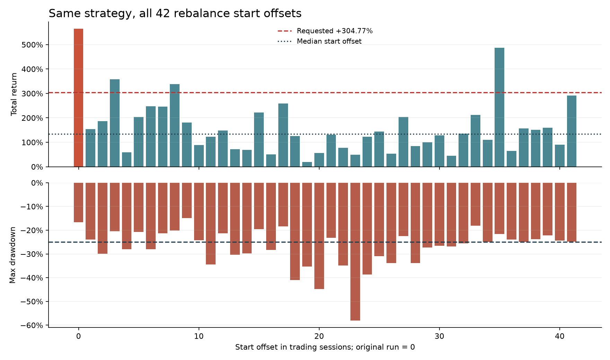
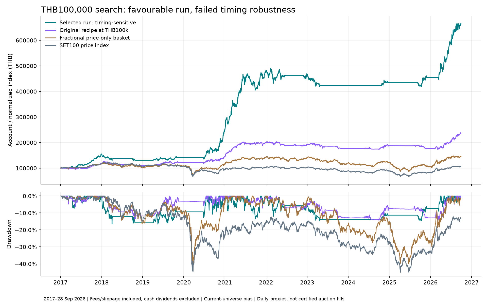

# THB100,000: search for approximately +304.77%

**Outcome: a historical target-beating candidate was found, but it failed the extended robustness audit. It is not approved for live funding.**

The frozen three-stock high-proximity candidate `60ee10de14d6268a` returned **+565.15%** after modeled fees/slippage, turning THB100,000 into **THB665,153.73** over January 4, 2017–September 28, 2026. CAGR was **+21.50%**, maximum drawdown **-16.62%**. These are fitted historical, price-only results, not a forecast.

Across all 42 rebalance offsets, total returns ranged from **+18.74% to +565.15%**, median **+133.37%**. Only **4 of 42** reached +304.77%; the worst drawdown was **-58.13%**. The original offset happened to be the best. The return target is therefore not stable across scheduling choices.

The largest three profit contributors—RCL, JMART, STECON—accounted for **74.6%** of net profit. Removing those names and rerunning produced **+64.24%**, with **-26.64%** drawdown. This exclusion is a diagnostic, not a proposed stock blacklist.



## Exact frozen rules

1. Rank eligible stocks by adjusted close divided by the maximum adjusted close over the trailing 252 sessions, including today’s completed close. Higher means nearer the one-year high. Exact ties follow the saved universe’s alphabetical order.
2. Eligibility requires 253 observed closes, an actual positive-volume bar, 20-session median turnover of at least THB10m, positive 252-session momentum skipping the latest 21 sessions, and adjusted close above SMA200. BANPU and THAI stay excluded.
3. Rebalance every 42 exchange-index sessions, anchored to the saved panel calendar starting 2016-01-04. This fixed anchor is part of the reported result.
4. Target three affordable stocks at 95% / 3 = 31.67% each before purchase friction. Retain prior desired names still among the best eight eligible affordable names, then fill empty slots. Leave unaffordable/unfilled allocations in cash; do not borrow.
5. Require the equal-weight market proxy above SMA200 at a scheduled rebalance. Also target cash after three consecutive completed sessions below that market average; execute at the next permitted observed window. Re-entry waits for a scheduled rebalance. This is a market-regime exit, not a guaranteed stop-loss or an individual-stock stop.
6. Use whole 100-share orders, prior-close sizing, a 35% cash funding envelope, and a prior-turnover participation limit. Do not finance purchases from unconfirmed sales in the same auction. Retry valid residuals at the close using the already-decided quantities.

Three slots are not three continuously held stocks. Average exposure was **41.8%**; one position reached **50.9%** of account value between rebalances. There were **216 fills** and **THB22,814.64** in explicit fees. Slippage is embedded in fills. End values do not deduct hypothetical terminal liquidation costs.

## Costs and execution assumptions

Base modeled explicit charges: commission 0.15% + exchange/clearing/regulatory charges totaling 0.007%, plus 7% VAT = **0.16799% per side**. Add **0.10% slippage per side**. The separate minimum-fee case applies THB50 daily commission before VAT; higher-cost uses 0.25% commission, the same levies/VAT, 0.20% slippage and THB50 daily minimum. These are representative published schedules, not a broker quote or a historical market-wide average. [DBS fee schedule](https://login.settrade.com/brokerpage/004/web/Commission-General.html).

100-share order lots are assumed conservatively throughout. SET has qualifying 50-share exceptions; their historical eligibility is not validated here. [SET trading units](https://www.set.or.th/en/market/information/trading-procedure/trading-units).

Three daily operating checks remain the intended design. Only daily morning-open and closing-price proxies were tested; afternoon auction execution is untested. Same-day closing prices never determine orders filled at that close. Actual auction queues, tick grids, broker cutoffs and historical cash-settlement permissions are not modeled. [SET trading hours](https://www.set.or.th/en/market/information/trading-procedure/trading-hours).

## Frozen shortlist sensitivities for this candidate

| Scenario | Full return | CAGR | Max DD | 2024–Sep2026 cold-start return |
|---|---:|---:|---:|---:|
| base | +565.15% | +21.50% | -16.62% | +57.20% |
| higher_cost | +509.36% | +20.41% | -17.79% | +54.29% |
| minimum_fee | +565.10% | +21.50% | -16.62% | +57.14% |
| delay_one | +601.38% | +22.16% | -17.68% | +55.37% |
| morning_only | +333.15% | +16.26% | -13.61% | +36.05% |
| close_only | +335.22% | +16.32% | -14.48% | +35.64% |
| missed_fills | +305.89% | +15.49% | -9.95% | +30.76% |
| phase_half | +130.93% | +8.98% | -23.23% | +43.37% |
| exclude_top3 | +118.17% | +8.35% | -22.13% | +57.03% |
| exclude_complex_actions | +201.63% | +12.01% | -18.49% | +44.10% |

The original predeclared shortlist screen passed: all 20 full/recent cases beat their matching fractional basket and stayed above −25% drawdown. **That preliminary pass is superseded by the failed all-offset and actual-contributor audits.** The −25% screen is a research criterion, not the user’s accepted loss limit. The original `selection.json` is retained to show the sequence; `final_decision.json` records the final status.

The `exclude_top3` scenario removes the earlier project’s leaders DELTA/RCL/KCE; the subsequent audit instead removes this candidate’s actual leaders RCL/JMART/STECON. They are different tests. Other sensitivity scenarios are individual changes, not simultaneous worst-case combinations.

## Comparable baselines

| Portfolio | Full return | Max drawdown |
|---|---:|---:|
| New candidate | +565.15% | -16.62% |
| Original 15-stock recipe at THB100k | +135.95% | -14.27% |
| Previous affordable 15-stock recipe at THB100k | +146.07% | -18.72% |
| Fractional price-only buy-and-hold basket | +45.43% | -40.16% |
| SET100 price index | +6.41% | -45.02% |

The fractional basket is an idealized benchmark, not a 100-stock portfolio executable at THB100k. SET100 price excludes dividends and index investment costs. Cash dividends are excluded from the new strategy and basket; they are neither reinvested nor credited to cash. The old +304.77% result used dividend-adjusted fractional units, different exclusions/calendar and THB1m capital. It is a numerical target here, not an apples-to-apples return comparison.



## Annual returns of the favourable run

| Year | New candidate | Original at THB100k | Fractional price basket | SET100 price |
|---|---:|---:|---:|---:|
| 2017 | +55.55% | +19.46% | +16.28% | +16.75% |
| 2018 | -15.83% | -7.13% | -12.84% | -9.83% |
| 2019 | +7.70% | +9.96% | +7.55% | +2.14% |
| 2020 | +73.50% | +18.15% | +4.57% | -13.03% |
| 2021 | +96.74% | +39.35% | +25.81% | +11.20% |
| 2022 | -3.47% | -3.91% | -1.43% | -0.32% |
| 2023 | -8.98% | -8.34% | -15.25% | -14.13% |
| 2024 | +2.98% | +6.27% | +2.87% | +1.08% |
| 2025 | +4.40% | -6.01% | -14.64% | -8.75% |
| 2026 YTD | +46.31% | +33.53% | +38.28% | +29.60% |

## Every tested recipe

The plan was frozen before this batch: **150 parameter variants of five previously explored ranking ideas plus two references = 152 recipes**. Each received full/recent base evaluations. Eight shortlisted recipes then received nine additional scenarios × two periods: **448 search/sensitivity evaluations**. Existing definitions were retested because the user changed capital to THB100,000. These are not 150 independent economic discoveries.

The frozen candidate then received **45 further diagnostic runs**: 40 previously untested rebalance offsets, two actual-profit-leader exclusions, and three cold-start blocks. Two other offsets reused existing results; one cold-start block repeats the recent-period check. A separate CLI replay and two independent ledger reconstructions verify accounting. No additional recipe was selected using those diagnostics.

| Candidate | Ranking | Slots | Rebalance | Market exit days | Full return | Max DD | Recent return | Status |
|---|---|---:|---:|---:|---:|---:|---:|---|
| `11577da5c7e54174` | high_proximity | 3 | 42 | 0 | +643.99% | -17.53% | +60.92% | Shortlisted, not final |
| `60ee10de14d6268a` | high_proximity | 3 | 42 | 3 | +565.15% | -16.62% | +57.20% | Failed extended audit |
| `c9fa9561cc04ca2f` | trend_quality | 3 | 10 | 0 | +295.09% | -29.92% | +57.75% | Not shortlisted |
| `ae2c65d221665ce2` | high_proximity | 5 | 42 | 0 | +242.18% | -12.78% | +53.66% | Not shortlisted |
| `dbb46459b0bd21d4` | trend_quality | 5 | 42 | 3 | +238.17% | -19.83% | +13.17% | Shortlisted, not final |
| `e6034ab52d14efa7` | high_proximity | 5 | 42 | 3 | +223.35% | -11.33% | +47.38% | Not shortlisted |
| `f35389a34adecccc` | trend_quality | 3 | 10 | 3 | +209.68% | -29.83% | +44.59% | Not shortlisted |
| `aa6704a4c9259cec` | medium_long | 3 | 21 | 0 | +203.46% | -28.96% | +57.96% | Not shortlisted |
| `747f76bb76502ab1` | medium_long | 3 | 21 | 3 | +202.78% | -34.75% | +85.98% | Not shortlisted |
| `82dc626fb89f1135` | trend_quality | 3 | 42 | 3 | +189.89% | -25.22% | +1.10% | Not shortlisted |
| `ee7526bb04a3f99c` | multi_horizon | 3 | 21 | 0 | +185.88% | -38.14% | +32.32% | Not shortlisted |
| `e3dc2f6972f60222` | trend_quality | 5 | 42 | 0 | +179.45% | -26.11% | +6.58% | Not shortlisted |
| `e0ed39f64b63c77a` | trend_quality | 10 | 21 | 0 | +174.78% | -18.81% | +17.91% | Not shortlisted |
| `80d32ff3dfccfd36` | medium_long | 3 | 42 | 3 | +172.35% | -24.12% | +24.05% | Shortlisted, not final |
| `a6e8e87d40591fa7` | high_proximity | 3 | 21 | 0 | +166.32% | -36.64% | +41.16% | Not shortlisted |
| `5142cfccd2100d47` | multi_horizon | 10 | 21 | 0 | +165.61% | -23.84% | +20.34% | Shortlisted, not final |
| `c9d7e77da027c78d` | trend_quality | 5 | 10 | 0 | +163.98% | -36.71% | +56.97% | Not shortlisted |
| `d4a24b024c03879e` | multi_horizon | 15 | 21 | 0 | +162.39% | -18.58% | +34.17% | Not shortlisted |
| `e11bda6f2fa99f3e` | trend_quality | 3 | 21 | 3 | +162.12% | -24.98% | +12.28% | Not shortlisted |
| `5d0d1aabdf472017` | medium_long | 10 | 21 | 0 | +159.79% | -26.58% | +29.47% | Not shortlisted |
| `23ab49b8f9e265cd` | high_proximity | 8 | 42 | 0 | +159.23% | -22.37% | +36.68% | Not shortlisted |
| `e6ebc33144a7a544` | risk_adjusted | 3 | 10 | 0 | +156.91% | -39.61% | +18.79% | Not shortlisted |
| `45c0cf9d4246f173` | trend_quality | 8 | 42 | 3 | +155.70% | -17.97% | +11.24% | Not shortlisted |
| `4d2b15d64131c5be` | high_proximity | 8 | 42 | 3 | +155.57% | -20.52% | +36.62% | Not shortlisted |
| `4385dfc2c1a0808f` | multi_horizon | 3 | 42 | 3 | +151.02% | -36.53% | +11.15% | Not shortlisted |
| `ae0b2550dab3307a` | risk_adjusted | 3 | 21 | 3 | +150.56% | -36.70% | +10.53% | Not shortlisted |
| `ed85990c5ed430fa` | medium_long | 5 | 42 | 3 | +148.85% | -29.75% | +27.23% | Not shortlisted |
| `c0b0ad4547efbd09` | multi_horizon | 3 | 21 | 3 | +146.49% | -40.31% | +36.06% | Not shortlisted |
| `32c6bbfe24f4099c` | trend_quality | 10 | 42 | 3 | +146.32% | -17.30% | +14.33% | Not shortlisted |
| `b142b3be5b992c7b` | multi_horizon | 15 | 21 | 0 | +146.07% | -18.72% | +31.76% | Shortlisted, not final |
| `4ae8c0e655012800` | high_proximity | 10 | 42 | 3 | +143.97% | -17.05% | +21.17% | Not shortlisted |
| `a056f88c6ddfd88a` | trend_quality | 10 | 21 | 3 | +143.34% | -19.99% | +23.22% | Not shortlisted |
| `639fa32882ed80e4` | trend_quality | 8 | 21 | 0 | +141.43% | -21.45% | +22.70% | Not shortlisted |
| `7906bb9ce1043d28` | multi_horizon | 5 | 10 | 0 | +141.37% | -30.61% | +55.15% | Not shortlisted |
| `6977033f683e691f` | high_proximity | 3 | 21 | 3 | +141.15% | -33.49% | +30.66% | Not shortlisted |
| `279aab0aee889478` | high_proximity | 5 | 10 | 0 | +140.24% | -26.01% | +37.34% | Not shortlisted |
| `416c6a94210c78e4` | trend_quality | 8 | 42 | 0 | +139.79% | -23.46% | +10.09% | Not shortlisted |
| `667448f7f69e7bc8` | medium_long | 8 | 21 | 0 | +139.77% | -26.14% | +36.85% | Not shortlisted |
| `e9e5c71138c74967` | trend_quality | 3 | 42 | 0 | +139.15% | -35.55% | -12.33% | Not shortlisted |
| `ab678a9c4767fe33` | multi_horizon | 5 | 21 | 0 | +136.35% | -39.70% | +11.10% | Not shortlisted |
| `e9a522bb24938501` | multi_horizon | 15 | 21 | 0 | +135.95% | -14.27% | +29.07% | Shortlisted, not final |
| `49bf78aaf5fcf6e5` | multi_horizon | 15 | 21 | 3 | +135.31% | -22.74% | +36.12% | Not shortlisted |
| `fa458d94733431ad` | risk_adjusted | 10 | 21 | 0 | +135.14% | -18.05% | +32.59% | Shortlisted, not final |
| `0940d0b35edb5969` | medium_long | 10 | 21 | 3 | +133.87% | -25.56% | +35.59% | Not shortlisted |
| `a7fd2f7b792e429e` | high_proximity | 10 | 42 | 0 | +132.98% | -19.20% | +19.08% | Not shortlisted |
| `aafa98676e21d7d8` | medium_long | 15 | 21 | 0 | +132.22% | -24.71% | +23.97% | Not shortlisted |
| `e3c88aa484f3f9e0` | high_proximity | 8 | 10 | 0 | +132.15% | -16.24% | +19.05% | Not shortlisted |
| `d65fe2d21dd044e3` | multi_horizon | 3 | 42 | 0 | +131.78% | -42.06% | -0.17% | Not shortlisted |
| `439ee641401f04e0` | medium_long | 10 | 10 | 0 | +130.33% | -30.29% | +36.23% | Not shortlisted |
| `c93b2600720afdfc` | medium_long | 8 | 21 | 3 | +129.71% | -23.02% | +41.47% | Not shortlisted |
| `e3a8b3ac48ce2aff` | trend_quality | 10 | 42 | 0 | +127.98% | -20.98% | +14.50% | Not shortlisted |
| `c83fbd730d8254f4` | multi_horizon | 8 | 21 | 0 | +127.92% | -32.90% | +12.50% | Not shortlisted |
| `c11c31b6076ac92c` | medium_long | 8 | 42 | 3 | +124.95% | -26.82% | +13.08% | Not shortlisted |
| `3f5700f31d57a686` | multi_horizon | 5 | 10 | 3 | +124.46% | -36.31% | +52.00% | Not shortlisted |
| `74836ee9189e9e5e` | multi_horizon | 10 | 21 | 3 | +123.82% | -26.80% | +24.64% | Not shortlisted |
| `c12111a5bf9feaa6` | medium_long | 3 | 42 | 0 | +123.69% | -40.18% | +20.27% | Not shortlisted |
| `df99974c36d4d60f` | risk_adjusted | 3 | 10 | 3 | +122.34% | -41.17% | +16.35% | Not shortlisted |
| `2905985437ebd10e` | high_proximity | 5 | 21 | 0 | +121.82% | -25.82% | +55.20% | Not shortlisted |
| `23c3dd419f5c1648` | multi_horizon | 10 | 42 | 0 | +121.54% | -22.52% | +7.39% | Not shortlisted |
| `e505d30c0c6b462a` | high_proximity | 5 | 10 | 3 | +121.39% | -24.78% | +34.75% | Not shortlisted |
| `3f7788626c6c0223` | trend_quality | 8 | 21 | 3 | +120.51% | -22.88% | +26.34% | Not shortlisted |
| `c1f858146831d68a` | multi_horizon | 5 | 21 | 3 | +119.11% | -38.73% | +15.23% | Not shortlisted |
| `73981619d445161c` | multi_horizon | 10 | 42 | 3 | +118.59% | -22.05% | +7.00% | Not shortlisted |
| `ea66f7a1ef9408b2` | risk_adjusted | 10 | 21 | 3 | +118.42% | -18.57% | +36.02% | Not shortlisted |
| `1be86f14b5b96753` | multi_horizon | 15 | 42 | 3 | +117.96% | -19.19% | +16.94% | Not shortlisted |
| `1ba96dd9896ea4c7` | trend_quality | 3 | 21 | 0 | +117.04% | -34.31% | -10.89% | Not shortlisted |
| `9480bb084ec66dc5` | multi_horizon | 10 | 10 | 0 | +113.91% | -29.64% | +37.08% | Not shortlisted |
| `bfcc8eb310511d55` | medium_long | 15 | 21 | 3 | +112.42% | -24.89% | +27.93% | Not shortlisted |
| `3d4a2bbce9968bb4` | multi_horizon | 15 | 10 | 0 | +111.25% | -21.61% | +26.73% | Not shortlisted |
| `34eaad2b92511af9` | medium_long | 8 | 42 | 0 | +111.14% | -28.81% | +10.70% | Not shortlisted |
| `68672504fd0e79c8` | multi_horizon | 8 | 42 | 3 | +109.98% | -26.52% | +8.14% | Not shortlisted |
| `42ef150df6bd7543` | trend_quality | 15 | 42 | 3 | +109.80% | -22.62% | +18.34% | Not shortlisted |
| `f3666d5553d91917` | medium_long | 5 | 42 | 0 | +109.43% | -37.41% | +25.64% | Not shortlisted |
| `e14f632ecfde30c1` | medium_long | 10 | 42 | 3 | +109.09% | -20.66% | +17.10% | Not shortlisted |
| `eb88a1d0e3e2a1aa` | multi_horizon | 5 | 42 | 3 | +109.08% | -38.17% | +10.16% | Not shortlisted |
| `78782a801441ef28` | risk_adjusted | 5 | 42 | 3 | +108.27% | -20.17% | +10.20% | Not shortlisted |
| `686f6857a529cd99` | high_proximity | 3 | 10 | 0 | +105.98% | -27.48% | +36.18% | Not shortlisted |
| `7f9f81b61f56fba0` | trend_quality | 15 | 21 | 0 | +103.13% | -23.25% | +18.95% | Not shortlisted |
| `14b7f4c7e6e8f91c` | medium_long | 15 | 10 | 0 | +102.01% | -28.94% | +28.80% | Not shortlisted |
| `b2fe0a6279629d1a` | multi_horizon | 5 | 42 | 0 | +101.56% | -38.80% | +3.28% | Not shortlisted |
| `b30922a578a531b3` | multi_horizon | 8 | 10 | 0 | +100.93% | -34.14% | +48.29% | Not shortlisted |
| `98787aba567141ee` | multi_horizon | 8 | 42 | 0 | +100.82% | -25.84% | +6.40% | Not shortlisted |
| `d6811edcb0242d3d` | high_proximity | 10 | 10 | 0 | +100.25% | -21.27% | +22.68% | Not shortlisted |
| `4da39b1df87d72c9` | risk_adjusted | 15 | 21 | 0 | +99.95% | -26.58% | +18.43% | Not shortlisted |
| `a87e7ebf3da9a3bc` | medium_long | 5 | 10 | 0 | +99.61% | -35.96% | +50.94% | Not shortlisted |
| `03e785973c510f79` | medium_long | 10 | 42 | 0 | +99.34% | -20.47% | +16.87% | Not shortlisted |
| `1b7b44afaf207b6e` | medium_long | 5 | 21 | 0 | +99.21% | -32.21% | +48.09% | Not shortlisted |
| `e29614bca420fd10` | high_proximity | 10 | 21 | 0 | +98.33% | -22.84% | +20.34% | Not shortlisted |
| `6a201c2f93ca3692` | multi_horizon | 8 | 21 | 3 | +97.60% | -33.40% | +12.57% | Not shortlisted |
| `dce4924002b50738` | multi_horizon | 15 | 42 | 0 | +97.39% | -21.76% | +17.57% | Not shortlisted |
| `e584c0995c8de0e7` | medium_long | 15 | 42 | 3 | +96.42% | -22.40% | +15.86% | Not shortlisted |
| `fe9ecb9b1773fad2` | high_proximity | 8 | 10 | 3 | +95.88% | -17.56% | +17.78% | Not shortlisted |
| `03d3fe6a0fc67c34` | trend_quality | 5 | 21 | 0 | +94.57% | -37.22% | +44.13% | Not shortlisted |
| `18beb6918b757ec6` | trend_quality | 15 | 10 | 0 | +94.47% | -26.57% | +25.30% | Not shortlisted |
| `42aeb11723e89cfc` | trend_quality | 8 | 10 | 0 | +93.26% | -29.24% | +28.06% | Not shortlisted |
| `2c1128e9b23d249f` | trend_quality | 5 | 10 | 3 | +92.70% | -41.02% | +55.06% | Not shortlisted |
| `95adf1bb8640d737` | risk_adjusted | 10 | 42 | 3 | +92.63% | -22.12% | +12.30% | Not shortlisted |
| `ded320de8100d703` | trend_quality | 5 | 21 | 3 | +92.14% | -38.68% | +56.85% | Not shortlisted |
| `c04240aef2f1e692` | high_proximity | 15 | 42 | 3 | +91.09% | -17.03% | +21.41% | Not shortlisted |
| `92b76ba032df401f` | risk_adjusted | 3 | 21 | 0 | +90.38% | -45.40% | -13.54% | Not shortlisted |
| `2a73a74ec9eee356` | trend_quality | 15 | 42 | 0 | +89.39% | -21.49% | +18.50% | Not shortlisted |
| `4426fc551db8e6a0` | high_proximity | 8 | 21 | 0 | +88.52% | -23.50% | +33.20% | Not shortlisted |
| `1838f565e482812c` | risk_adjusted | 8 | 21 | 0 | +87.98% | -30.59% | +25.17% | Not shortlisted |
| `36a82e9917e427ba` | risk_adjusted | 15 | 42 | 3 | +87.36% | -24.73% | +12.83% | Not shortlisted |
| `98aa22b8f9fa0288` | trend_quality | 15 | 21 | 3 | +87.18% | -24.67% | +20.65% | Not shortlisted |
| `b5c1bbed99d197e3` | trend_quality | 10 | 10 | 0 | +86.80% | -24.79% | +20.21% | Not shortlisted |
| `2039cb9f04417bed` | medium_long | 15 | 42 | 0 | +86.80% | -21.81% | +16.17% | Not shortlisted |
| `884cc89db2142238` | multi_horizon | 15 | 10 | 3 | +86.71% | -22.33% | +23.58% | Not shortlisted |
| `0750f8a4dd986d26` | risk_adjusted | 8 | 21 | 3 | +85.65% | -30.89% | +33.46% | Not shortlisted |
| `ddb6f5a9b34baae4` | high_proximity | 15 | 42 | 0 | +85.03% | -16.84% | +21.08% | Not shortlisted |
| `40c3a2e0b9158653` | risk_adjusted | 15 | 21 | 3 | +82.22% | -30.03% | +21.72% | Not shortlisted |
| `9653a439ffac3239` | risk_adjusted | 10 | 42 | 0 | +79.67% | -19.55% | +12.40% | Not shortlisted |
| `635674fb0e424891` | medium_long | 8 | 10 | 0 | +79.56% | -30.99% | +38.96% | Not shortlisted |
| `c49bfc4af5dd781c` | medium_long | 10 | 10 | 3 | +79.55% | -33.10% | +31.07% | Not shortlisted |
| `45498ffe649295a3` | risk_adjusted | 15 | 42 | 0 | +79.32% | -22.69% | +12.95% | Not shortlisted |
| `7b870c16b00e3da2` | risk_adjusted | 15 | 10 | 0 | +79.20% | -25.57% | +17.11% | Not shortlisted |
| `776b1a9e188edbac` | high_proximity | 10 | 10 | 3 | +79.02% | -22.41% | +19.55% | Not shortlisted |
| `c69faef1c686255c` | multi_horizon | 8 | 10 | 3 | +78.63% | -33.07% | +43.52% | Not shortlisted |
| `86c6364de5be00da` | risk_adjusted | 5 | 21 | 0 | +77.12% | -34.35% | +31.93% | Not shortlisted |
| `d47cec1dc3fd8d22` | risk_adjusted | 8 | 42 | 3 | +76.36% | -21.43% | +5.39% | Not shortlisted |
| `95afd9f60326ea24` | high_proximity | 10 | 21 | 3 | +74.75% | -24.44% | +21.87% | Not shortlisted |
| `cbb36b2269e28bc3` | high_proximity | 15 | 10 | 0 | +73.81% | -24.32% | +18.40% | Not shortlisted |
| `74cd4c6a5cc0e5e4` | medium_long | 15 | 10 | 3 | +73.73% | -32.06% | +22.56% | Not shortlisted |
| `85ad45220683586c` | risk_adjusted | 5 | 10 | 0 | +73.21% | -38.03% | +21.85% | Not shortlisted |
| `cc2ec6843ec4ffc0` | multi_horizon | 10 | 10 | 3 | +73.16% | -33.15% | +33.52% | Not shortlisted |
| `cbd0c9e8cbbed5e1` | trend_quality | 15 | 10 | 3 | +72.94% | -28.91% | +21.43% | Not shortlisted |
| `77412813080c5f2c` | high_proximity | 8 | 21 | 3 | +67.57% | -22.29% | +38.00% | Not shortlisted |
| `5ec219cd3b27db4f` | medium_long | 5 | 21 | 3 | +67.38% | -32.25% | +56.37% | Not shortlisted |
| `f786142d2051ef4f` | medium_long | 5 | 10 | 3 | +66.31% | -36.34% | +48.59% | Not shortlisted |
| `7fc21aa18f17209a` | trend_quality | 8 | 10 | 3 | +64.68% | -35.94% | +23.09% | Not shortlisted |
| `02d916714e612eaa` | high_proximity | 15 | 21 | 0 | +63.55% | -32.30% | +12.65% | Not shortlisted |
| `485145597ee2ca3f` | trend_quality | 10 | 10 | 3 | +63.50% | -29.88% | +19.76% | Not shortlisted |
| `ffdb8797f3bf57a2` | risk_adjusted | 10 | 10 | 0 | +61.48% | -29.80% | +28.03% | Not shortlisted |
| `32304aa8d256960a` | risk_adjusted | 5 | 21 | 3 | +60.32% | -35.52% | +48.60% | Not shortlisted |
| `d93074ebeac54a84` | high_proximity | 5 | 21 | 3 | +60.02% | -26.90% | +48.51% | Not shortlisted |
| `7b2c5e82a4606790` | risk_adjusted | 15 | 10 | 3 | +59.93% | -27.56% | +14.96% | Not shortlisted |
| `2d1ffe152f343530` | risk_adjusted | 5 | 10 | 3 | +58.79% | -39.34% | +17.56% | Not shortlisted |
| `9bc6236be43ff10b` | medium_long | 3 | 10 | 0 | +57.60% | -44.25% | +38.78% | Not shortlisted |
| `ec22d525a8ce754f` | high_proximity | 15 | 10 | 3 | +56.30% | -25.65% | +15.04% | Not shortlisted |
| `05932334b699020e` | risk_adjusted | 8 | 42 | 0 | +56.08% | -25.78% | +3.31% | Not shortlisted |
| `6253ccd08826bdec` | multi_horizon | 3 | 10 | 0 | +55.95% | -39.70% | +33.75% | Not shortlisted |
| `5fd612349599ebb1` | risk_adjusted | 3 | 42 | 3 | +55.60% | -24.77% | +0.78% | Not shortlisted |
| `096162757a79db9b` | medium_long | 8 | 10 | 3 | +54.14% | -33.34% | +30.72% | Not shortlisted |
| `1687740dff762623` | high_proximity | 3 | 10 | 3 | +53.72% | -26.76% | +40.60% | Not shortlisted |
| `fa10461c3a79a6b6` | risk_adjusted | 8 | 10 | 0 | +53.65% | -26.70% | +40.15% | Not shortlisted |
| `c0363248f99c5233` | high_proximity | 15 | 21 | 3 | +53.15% | -32.96% | +12.49% | Not shortlisted |
| `84ae521b0adbfb77` | risk_adjusted | 5 | 42 | 0 | +45.66% | -29.29% | +4.20% | Not shortlisted |
| `ee56dd43e37628ca` | risk_adjusted | 8 | 10 | 3 | +37.91% | -32.71% | +30.30% | Not shortlisted |
| `4f78e1e904bdc55e` | risk_adjusted | 10 | 10 | 3 | +34.87% | -34.56% | +13.95% | Not shortlisted |
| `122bada6de25fe10` | risk_adjusted | 3 | 42 | 0 | +33.09% | -32.04% | -7.91% | Not shortlisted |
| `2d5e97f5e78cbcf6` | medium_long | 3 | 10 | 3 | +31.66% | -48.26% | +38.13% | Not shortlisted |
| `0fef6729d192c825` | multi_horizon | 3 | 10 | 3 | +30.90% | -40.90% | +29.34% | Not shortlisted |

The numerically highest return was **+643.99%** from the related three-stock strategy without the daily market exit; it failed even the initial timing/drawdown screen. It was not selected. Recipe IDs link to exact settings in `manifest.json`; all evaluations are retained in `all_results.csv` and the project SQLite registry. Rejections are never erased.

## Data limits and decision

All history through September 28, 2026 has already been inspected. Yearly blocks and recent-period results are retrospective diagnostics, not untouched holdouts. Current SET100 membership creates survivorship bias; former members and effective-date membership are missing. Split reversal uses provider action ratios, not certified historical exchange quotes; mergers, stock dividends and entitlement dates need reconciliation. The stress removing complex actions reduces this candidate to +201.63%. Additional capital does not repair these issues.

**Final decision: preserve this strategy as an experimental candidate, reject it as evidence of dependable +304.77% performance or readiness for live money.** The experiment meets the numerical target in a favourable retrospective run, but not consistently under rebalance timing and contributor tests. Future performance requires genuinely new forward observations and improved historical data; continuing to search this same history cannot establish certainty.

## Reproduce and inspect

```bash
.venv/bin/python -m backtest.capital_ranked --accept-snapshot-bias --output reports/my_100000_replay
```

Frozen module: `strategy/set100_high_proximity_100000.py`; configuration: `configs/set100_100000_strategy.json`. Neither contains live order routing. The previous THB30k strategy and reports remain available as historical work.

Independent ledger replay reconstructed the selected run’s **216 fills** with maximum NAV error **THB0.000000000**. Every submitted quantity is a multiple of 100; cash remained nonnegative and purchases did not use same-window sale proceeds. The CLI reproduction matches every saved equity observation.

- [All evaluations](all_results.csv), [exact recipes and hashes](manifest.json), [original shortlist decision](selection.json), [final decision](final_decision.json).
- [Phase audit](rebalance_phase_audit.csv), [additional diagnostics](additional_diagnostics.csv), [audit summary](audit_summary.json), [accounting verification](verification.json).
- [Annual returns](annual_returns.csv), [monthly returns](monthly_returns.csv), [candidate attribution](60ee10de14d6268a/attribution.csv).
