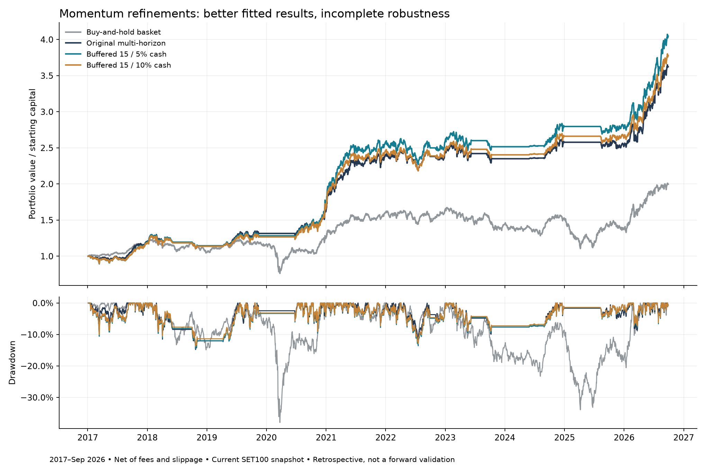

# Multi-horizon momentum challenge

**Historical improvement found; no refinement passed every robustness requirement.** The 15-stock buffered variant with 5% target cash returned 304.77% versus 262.29% for the original, while maximum drawdown fell from 14.79% to 14.50%. The 10% cash version traded some return for a larger drawdown reduction. Both failed strict dominance when delaying fills or excluding THAI. They are experimental alternatives, not replacements proven superior.

## Results after trading costs

Evaluation: January 2017–September 28, 2026; THB1 million initial capital. Net compounded returns, including unrealized ending holdings; no hypothetical final-sale charge. Benchmark is equal-initial-allocation buy-and-hold of the fixed current 100-name snapshot, BANPU excluded/cash—not the official SET100 index.

| Strategy | Total return | CAGR | Max drawdown | THB1m becomes | Average invested |
|---|---:|---:|---:|---:|---:|
| Buy-and-hold basket | 99.67% | 7.37% | -37.98% | 1,996,693 | 91.40% |
| Original multi-horizon | 262.29% | 14.14% | -14.79% | 3,622,873 | 65.10% |
| Buffered 15 / 5% cash | 304.77% | 15.45% | -14.50% | 4,047,692 | 63.29% |
| Buffered 15 / 10% cash | 278.00% | 14.64% | -13.76% | 3,779,960 | 60.02% |

The 5% and 10% reserves are target minimums at scheduled rebalances. Actual cash is often higher because the market filter switches off or fewer stocks qualify; weights drift between rebalances.

## The rule

1. Rank the mean cross-sectional percentile of adjusted-price returns over 63, 126 and 252 sessions, skipping the latest 21 sessions.
2. Require positive 252-session skipped-month momentum, price above its 200-session average, 253 observed bars, positive current volume and 20-session median turnover of at least THB10m.
3. Use the same equal-weight market proxy and 200-session market trend filter as the original; its universe has the same current-membership bias.
4. At each 21-session rebalance, retain previously targeted names still ranked within the top 20 eligible stocks. Fill vacancies from the ranking until holding at most 15 names. The rank buffer aims to reduce unnecessary replacement. It tracks desired membership; actual fills can be delayed or skipped.
5. Target 95%/15 = 6.333% per selected stock, leaving at least 5% target cash. The cautious variant uses 90%/15 = 6%. Unused slots stay cash. Signals use the close; orders execute at the following calendar-session open if actually tradable, otherwise they are skipped until the next scheduled target.

The monthly wording is approximate: schedules are anchored every 21 union-panel sessions, not calendar month-end. No shorting or leverage. No stop-loss or intraday execution is assumed.

## Recent and expensive-execution checks

| Strategy | 2024–Sep2026 return | Recent max drawdown | Full stress return | Full stress max drawdown |
|---|---:|---:|---:|---:|
| Buy-and-hold basket | 22.50% | -29.43% | 99.18% | -37.97% |
| Original multi-horizon | 54.19% | -8.67% | 219.65% | -15.46% |
| Buffered 15 / 5% cash | 60.88% | -7.74% | 262.47% | -15.19% |
| Buffered 15 / 10% cash | 57.24% | -7.35% | 240.42% | -14.42% |

Base costs: commission 0.15% + exchange/clearing/regulatory fees 0.007%, plus VAT7% on those fees = **0.16799% per side**, and modeled slippage **0.10% per side**. Stress: 0.27499% fees, 0.20% slippage, THB50 daily minimum commission before VAT. Cash earns zero. These are representative published rates, not a measured broker average. [Kasikorn fee schedule](https://www.kasikornsecurities.com/en/startinvesting/fee/thai-stocks); [DBS fee schedule](https://login.settrade.com/brokerpage/004/web/Commission-General.html). Both rechecked September29,2026. Present-day rates are held constant across historical dates.

## Where the advantage fails

Same-cost comparison after perturbing BOTH strategies. All numbers below use the full period. Buffered variants remain higher-return in all four scenarios, but their drawdowns are worse under delayed execution and THAI exclusion. The gate demanded both improvements in every scenario, so neither qualifies for promotion.

| Scenario | Original return / DD | Buffered 5% return / DD | Buffered 10% return / DD |
|---|---:|---:|---:|
| One additional execution session | 290.38% / -12.93% | 344.95% / -14.00% | 312.88% / -13.30% |
| Exclude DELTA | 181.15% / -14.93% | 205.08% / -14.55% | 188.38% / -13.82% |
| Exclude THAI | 287.69% / -11.85% | 326.37% / -13.61% | 297.11% / -12.93% |
| Shift rebalance schedule +10 sessions | 184.73% / -15.67% | 237.77% / -14.78% | 218.17% / -14.04% |

The 5% prototype is highlighted after examining full-period results because it has the highest return among the five variants passing the normal and stress comparisons. The 10% version illustrates a lower-exposure tradeoff. This is descriptive post-selection; neither is the predeclared robust winner.

## Search history and reproducibility

- Batch1: 223 new variants; one passed the 2017–2023 screen. It failed later strict comparison (higher stress drawdown, slightly worse recent base drawdown).
- Batch2: 12 adaptive cash-reserve variants; five passed the screen and normal/stress comparisons. All failed at least one robustness requirement.
- Batch3: 36 adaptive staggered-rebalance variants; two passed the screen, both failed full-period return requirements. No further tuning after this batch.
- **271 new specifications, 552 total including the earlier281.** The SQLite registry contains additional comparator, period, cost and verification evaluations; those are not new strategies.
- Shortlists were written before examining their recent/full results within each batch. All dates were previously seen, and later batches were informed by earlier outcomes. No claim of an untouched holdout or statistical significance is justified.
- The original five active strategies remain in `strategy/active.json`. The optional experimental module can reproduce either buffered variant; rejected standalone modules were not added.

[Every new trial and reason](../../research/experiments/REFINEMENT_LEDGER.md) · [Combined numeric ledger](../../research/experiments/STRATEGY_LEDGER.csv) · [Comparison metrics](comparison.csv) · [Yearly returns](annual_returns.csv) · [Sensitivity details](../momentum_reserve_20260929/sensitivity_results.csv)

```bash
.venv/bin/python -m backtest.run --strategy experimental_buffered_momentum --accept-snapshot-bias --output reports/buffered_new_run
.venv/bin/python -m backtest.run --strategy experimental_buffered_momentum --params '{"reserve":0.10}' --accept-snapshot-bias --output reports/buffered10_new_run
.venv/bin/python -m backtest.run --strategy experimental_buffered_momentum --cost-profile stress --accept-snapshot-bias --output reports/buffered_stress_new_run
```

Verification: saved-module CLI reproductions match the search equity curves within 1e-12. Independent cash-and-position replay of 12 exported ledgers (three portfolios × full/recent × base/stress) reproduces ending and daily equity within 1e-9. Causality, exclusion, sizing, delayed execution, fees and canonical identity are covered by the project tests.

## Limits on the conclusion

Repeated selection can fit noise. Current SET100 membership introduces survivorship bias; historical membership intervals and delisted price histories are not yet implemented. Provider adjusted OHLC uses fractional units, approximate liquidity and stale marks through data gaps, with incomplete corporate-action and suspension reconciliation. BANPU remains quarantined. No board lots, tick grids, price-limit queues or market-impact capacity model. Dividends are reflected only through adjusted prices and are not separately credited. The snapshot buy-and-hold basket is not the official index.

**Conclusion:** the requested higher-return/lower-drawdown pair exists in the fitted backtest, but a reliable improvement over multi-horizon momentum has not been established. Freeze these definitions before future paper evaluation; dates after September28,2026 are reserved.


