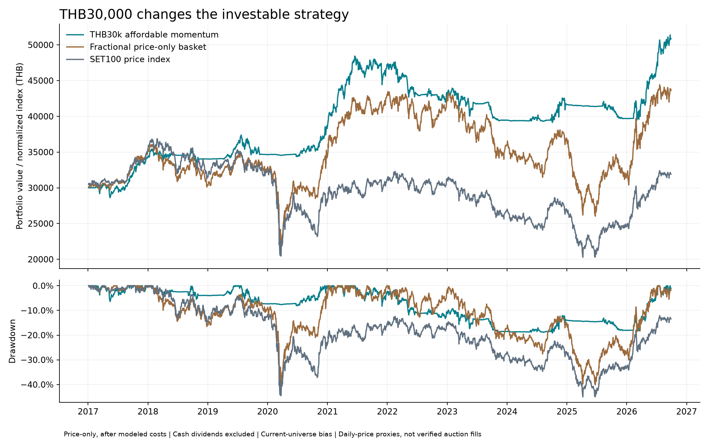

# One strategy candidate for THB30,000

**Selected for further validation, not ready for live money:** SET100 Affordable Buffered Momentum, candidate `b142b3be5b992c7b`. Starting capital THB30,000. The user has not selected a broker or drawdown threshold. No live order routing or recurring trading task has been enabled.

The earlier +304.77% return was a THB1m fractional adjusted-unit result. It does not establish what a THB30,000 whole-lot account can achieve. This study changes capital, sizing, calendar, exclusions and accounting; its return is price-only and excludes cash dividends. The two headline results are not directly comparable.

## Locked rules

1. Use completed daily adjusted prices for equal-weight percentile ranks of 63-, 126- and 252-session momentum, skipping the latest 21 sessions.
2. Require at least 253 observed closes, positive recent volume, 20-session median turnover of THB10m, positive skipped-year momentum and price above SMA200.
3. At every 21-session scheduled decision, require the equal-weight market proxy above SMA200; otherwise target cash.
4. Use **15 target slots**, with **90% total target allocation**: approximately **6% per slot**. Starting at THB30,000 that is THB1,800 per slot before costs. Screen out stocks whose board lot cannot fit. Select the highest-ranked affordable stocks; keep prior targets still within the top 20 eligible affordable names.
5. Round orders down to whole lots. Leave unused allocations as cash. Target quantities are fixed from pre-auction information and are not enlarged using the eventual opening price.
6. Reconcile and retry legitimate residuals at the next permitted window; do not finance buys from unconfirmed sells in the same auction. Do not trade three times just because three checks occur.
7. No fixed stop-loss or daily confirmed-market exit was selected. The tested daily-exit alternatives were not superior under the declared robustness rule. A portfolio halt is a separate risk policy; the user threshold remains unset and has no performance claim here.

Fifteen slots does not guarantee fifteen actual holdings. Cash, unaffordable lots and corporate-action residuals change the actual count. No margin or short sales. This study retains BANPU and THAI exclusions.

## Results for the chosen candidate

| Scenario | Full return | CAGR | Max drawdown | 2024–Sep2026 return | Recent drawdown |
|---|---:|---:|---:|---:|---:|
| base | +69.54% | +5.58% | -19.18% | +28.70% | -6.54% |
| minimum_fee | +51.77% | +4.38% | -19.77% | +23.43% | -6.70% |
| higher_cost | +55.04% | +4.61% | -21.70% | +22.57% | -6.86% |
| delay_one | +72.82% | +5.78% | -17.97% | +28.09% | -6.42% |
| morning_only | +70.10% | +5.61% | -19.17% | +28.74% | -6.51% |
| close_only | +64.97% | +5.28% | -18.22% | +22.64% | -7.36% |
| missed_fills | +52.49% | +4.43% | -16.82% | +15.94% | -9.64% |
| phase_10 | +70.09% | +5.61% | -12.74% | +27.80% | -7.96% |
| exclude_top3 | +47.55% | +4.08% | -16.19% | +29.08% | -6.52% |
| exclude_complex_actions | +44.03% | +3.82% | -13.63% | +15.77% | -7.84% |

Base ending value: **THB50,861**, from THB30,000. Explicit modeled fees: **THB2,000**. Average invested exposure: **42.2%**. Largest single holding weight: **13.9%**. Slippage is already in trade prices. Cash earns zero.

The same-exclusion, fractional price-only basket returned **+45.43%**, CAGR **+3.92%**, with **-40.16% drawdown**. It is an idealized comparison, not a 100-stock portfolio executable with THB30,000. SET100 price is shown separately in the figure and annual table.

Base explicit fees are 0.16799% per side plus 0.10% slippage. `minimum_fee` adds THB50 minimum daily commission before VAT; `higher_cost` uses 0.27499% explicit fees, 0.20% slippage and that minimum. Fees aggregate by day, not per order/window. Higher fees can change affordable lots and later holdings, so stress results need not be monotonic.

The candidate passed all 20 full/recent comparisons against the stated basket, with a declared −25% drawdown research screen. That screen is not a promised drawdown limit or the user’s accepted risk. Worst tested drawdown was approximately −21.70%; future losses may be larger.



## All nine candidates, including rejected refinements

| Candidate | Full base return | CAGR | Max DD | Worst full CAGR across scenarios | Passed all screens? |
|---|---:|---:|---:|---:|---|
| original_15 | +51.56% | +4.37% | -8.78% | +2.43% | No |
| affordable_5_exit0 | +63.81% | +5.20% | -37.88% | +3.73% | No |
| affordable_5_exit3 | +54.61% | +4.58% | -39.74% | +2.99% | No |
| affordable_8_exit0 | +123.55% | +8.62% | -31.31% | +5.35% | No |
| affordable_8_exit3 | +128.61% | +8.87% | -30.72% | +4.94% | No |
| affordable_10_exit0 | +122.73% | +8.58% | -25.93% | +5.26% | No |
| affordable_10_exit3 | +105.31% | +7.67% | -24.98% | +5.09% | No |
| affordable_15_exit0 | +69.54% | +5.58% | -19.18% | +3.82% | Yes |
| affordable_15_exit3 | +58.90% | +4.87% | -19.24% | +2.55% | No |

The 5- and 8-stock variants had larger drawdowns. The highest headline return was not selected. Exactly eight capital-aware variants and the original reference were evaluated, across ten scenarios and two periods: **180 evaluations**. Every result and rejection is retained; the grid was not expanded after seeing results.

## Annual price-only returns

| Year | Selected strategy | Fractional basket | SET100 price |
|---|---:|---:|---:|
| 2017 | +14.22% | +16.28% | +16.75% |
| 2018 | -0.69% | -12.84% | -9.83% |
| 2019 | +1.84% | +7.55% | +2.14% |
| 2020 | +10.50% | +4.57% | -13.03% |
| 2021 | +23.29% | +25.81% | +11.20% |
| 2022 | -8.63% | -1.43% | -0.32% |
| 2023 | -8.53% | -15.25% | -14.13% |
| 2024 | +5.55% | +2.87% | +1.08% |
| 2025 | -4.69% | -14.64% | -8.75% |
| 2026 YTD | +28.13% | +38.28% | +29.60% |

## Three-window operating design

| Bangkok time | Check and intended action |
|---|---|
| 09:45–before 09:55 | Previous completed-day signal; size morning ATO using confirmed cash, actual board lots and current exchange metadata |
| 13:45–before 13:55 | Reconcile morning fills/cancellations and buying power; retry valid residuals via afternoon ATO |
| 16:30–before 16:35 | Final same-day reconciliation and justified residual/risk orders via ATC |

The actual exchange session and broker acceptance cutoff must override the clock. A late ATO can become a continuous-session market order. Order-status monitoring must continue between windows. A final daily close cannot be used to decide an order executed in that same closing auction. Holidays, halts, stale data, duplicate orders and uncertain broker acknowledgements must prevent new submissions.

**Only daily open/close proxies were backtested. There is no historical afternoon auction fill claim.** The three-window design has no broker implementation yet, as requested while choosing the strategy first.

## What still prevents live readiness

- Actual historical auction prices, volume, indicative quotes, partial-fill behavior and afternoon data are absent.
- Historical SET100 effective membership, exited/delisted stocks, two missing stock sessions and entity continuity still need repair. All tested history was already seen.
- Prices were reconstructed by reversing provider-reported subsequent split ratios. This is a mathematical transformation, not observed exchange tape. Provider stock-dividend/rights classifications, entitlement dates and share delivery are not fully verified.
- A uniform 100-share order lot is a conservative assumption. SET can use 50 shares for qualifying high-priced stocks; actual historical/current lot metadata is required. Cash dividends, withholding, payment dates, subscriptions and terminal liquidation are excluded.
- Corporate actions leave **THB295.18** of odd-lot/fractional residual value at the base endpoint. These balances are marked, not silently sold in auctions. A pure auction-only system needs an explicit residual exit process.
- Broker/API support, actual fee minimum, account settlement/buying-power rules and the user’s drawdown limit remain unknown.
- A frozen forward paper test, including missed/duplicate messages, reconnects and partial fills, has not happened. More tuning of known history cannot replace it.

## Reproduce and audit

```bash
.venv/bin/python -m backtest.small_capital --capital 30000 --accept-snapshot-bias --output reports/my_30000_run
```

Use `--cost-profile minimum_fee` or `--cost-profile stress` in a new output folder. The saved module is `strategy/set100_small_capital.py`; its settings are `configs/set100_selected_strategy.json`. Neither enables live orders.

Independent ledger replay checked **697 fills**, verified every submitted quantity is a multiple of 100, and reconstructed NAV with maximum error **THB0.000000000**. Buy spending never used proceeds from sells in the same auction. The saved module reproduces the selected equity curve exactly.

- [All evaluations](all_results.csv), [selection and failures](selection.json), [plan/data/code provenance](manifest.json), [verification](verification.json), [ending holdings and odd lots](ending_holdings.csv).
- [SET hours](https://www.set.or.th/en/market/information/trading-procedure/trading-hours), [order types](https://www.set.or.th/en/market/information/trading-procedure/order-types), [lot sizes](https://www.set.or.th/en/market/information/trading-procedure/trading-units), [split-adjusted provider convention](https://github.com/ranaroussi/yfinance/issues/1749).
- [Official DELTA split example](https://www.set.or.th/en/market/news-and-alert/newsdetails?id=2023046335&symbol=DELTA): the provider shows approximately THB74.80 on April 27, 2023; reversing the next day’s 10-for-1 split gives approximately THB748.00. Treating THB74.80 as the original quote would falsely make the stock affordable in a small historical portfolio.
